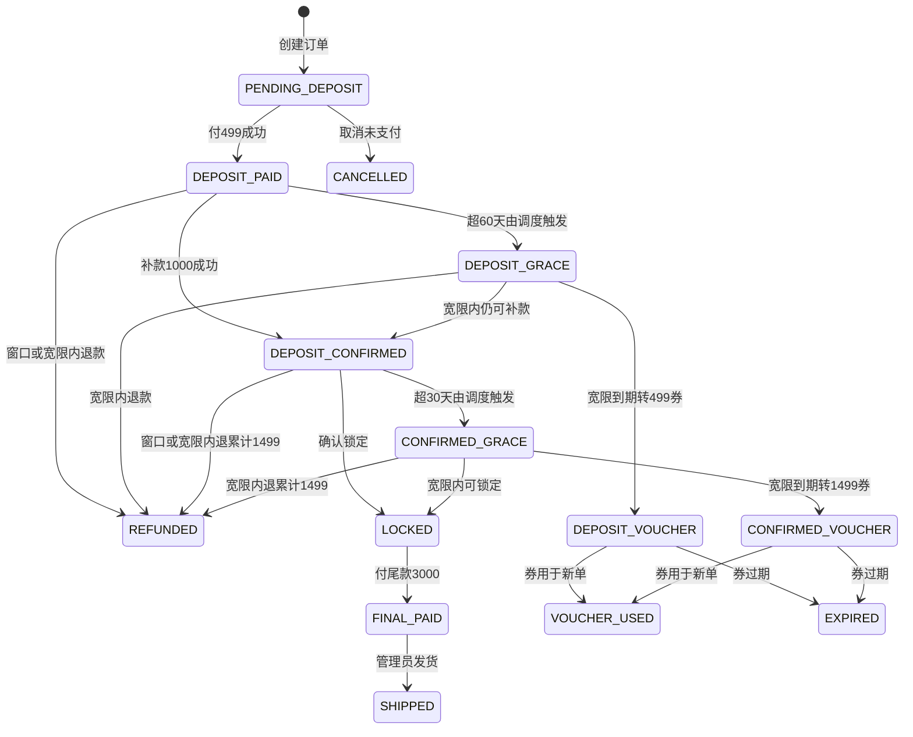
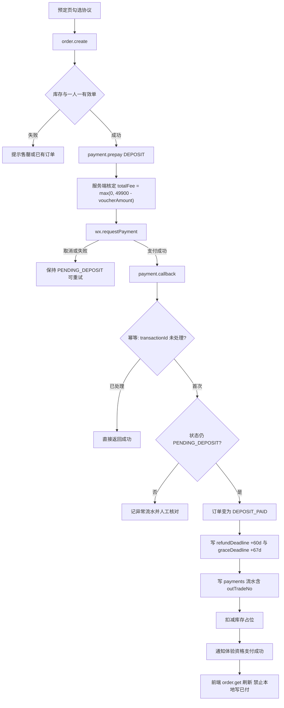
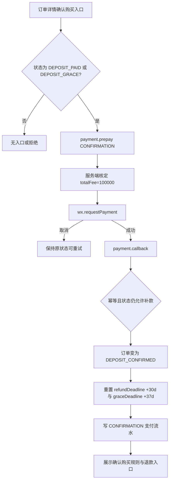
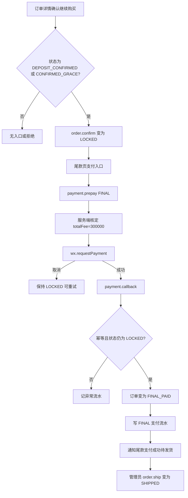
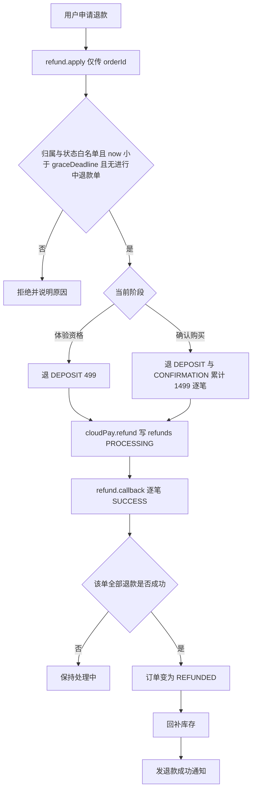
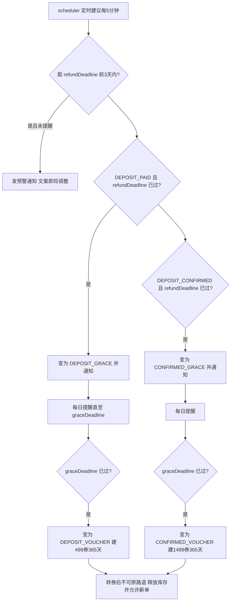

# XOLOme X1 小程序 · 上线需求说明书

> **日期**：2026-07-22｜**AppID**：`wxffabef26186fbe67`  
> **本机**：`D:\cursoe_code\XOLOme-Miniapp`｜**GitHub**：https://github.com/HSDCT1230/XOLOme-miniapp  
> **代码根（开发者工具）**：`xolome-miniapp/`｜**废弃**：`E:\Xolome微信小程序\`  
> **目标**：审核通过后的**正式发布版**；问卷云收集 + 微信支付 ¥499 + 补款至 ¥1,499 + **尾款 ¥3,000** + 完整退款同版本上线。  
> **关联**：`docs/XOLOme_X1_PRD.md`（文案细则可参照；**不得用 PRD 砍掉本期补款/退款/尾款**）

---

## 1. 范围与硬约束

### 1.1 本期必须正式上线

| # | 能力 | 验收要点 |
|---|------|----------|
| 1 | 正式版可打开 | 审核通过后全量用户可用（开发调试可用开发版，**不以体验版作为交付形态**） |
| 2 | 问卷入库 | 写云库 `surveys`；可导出；¥500 问卷券码；同用户不重复刷券 |
| 3 | 付 ¥499 | 微信支付成功 → `DEPOSIT_PAID`；商户可见收款 |
| 4 | 补款 +¥1,000 | → `DEPOSIT_CONFIRMED`（累计 ¥1,499）；商户可见收款 |
| 5 | 尾款 ¥3,000 | `LOCKED` → 付尾款 → `FINAL_PAID`；商户可见收款 |
| 6 | 退款全链路 | 窗口内原路退 → `REFUNDED`；超窗：提前 3 天通知 + 7 天宽限 → 转券 365 天 |
| 7 | 文案合规 | 对外只说「体验资格 / 确认购买」规则；禁止 Day60、宽限期、状态码 |
| 8 | 对账 | 订单 / 支付（499+补款+尾款）/ 退款 / 库存可与商户平台核对 |

### 1.2 可后开

发货履约运营提效（`ship` 须管理员鉴权）｜DIY web-view｜独立 Admin（本期用云控制台 + 导出即可）

### 1.3 禁止

只收不退｜只上 499、补款/尾款后做｜Mock 假装已收款/已退款｜把体验版当成正式交付

**冲突裁决**：上线范围以本说明书（业务方）为准；金额/天数/状态名以 `config.js` + `constant.js` 为代码基准，与 PRD 冲突时按下文「正确规则」统一。

---

## 2. 用户旅程（上线后）

```
打开正式版 → 首页 → 填问卷（云库 + ¥500 券码）
  → 预定 → 微信支付 ¥499 → DEPOSIT_PAID
  →（期内）补款 +¥1,000 → DEPOSIT_CONFIRMED
  → 窗口内可申请原路退；超窗 → 通知 → 宽限 → 转代金券
  → 确认锁定 → LOCKED → 尾款 ¥3,000 → FINAL_PAID → 发货
```

展会话术：可说「扫码问卷领券、微信支付锁定体验资格、可补款确认购买、发货前付尾款、系统按规则退款」；禁止「能付不能退 / 退款线下再说 / Mock 当已收款」。

---

## 3. 付费逻辑（正确规则 · 本期核心）

> 下列规则为**应实现的正确逻辑**。当前 Mock/云函数存在多处冲突，见 §3.9。  
> 若 Markdown 预览不渲染流程图，用浏览器打开同目录 [`付费流程图预览.html`](./付费流程图预览.html)。

### 3.1 价格与阶段

| 阶段 | 金额（分） | 累计已付 | 用户文案 | 本期 |
|------|------------|----------|----------|------|
| 体验资格 | 49900（¥499） | ¥499 | 锁定首发体验资格 · 60 天可退 | **必达** |
| 确认购买补款 | +100000（¥1,000） | ¥1,499 | 补足至 ¥1,499 · 30 天可申请退 | **必达** |
| 尾款 | +300000（¥3,000） | ¥4,499 | 发货前尾款 · 付后不可退 | **必达** |
| 零售展示 | 499900 / 449900 | — | 原价 ¥4,999 / 券后 ¥4,499 | 展示 |

**时间窗（以支付成功回调时刻起算）**

| 项 | 天数 | 说明 |
|----|------|------|
| 体验资格可退窗口 | 60 | `refundDeadline = T0 + 60d` |
| 确认购买可退窗口 | 30 | 补款成功时刻起算，重置 `refundDeadline` |
| 提前预警 | 3 | `refundDeadline` 前 3 天起可发预警 |
| 宽限期 | 7 | `graceDeadline = refundDeadline + 7d`；期内**仍可原路退**，也可补款/确认锁定 |
| 转券有效 | 365 | 宽限期结束后转券，不可再原路退该笔 |
| 尾款 | — | `LOCKED` 后付 ¥3,000；**锁定后不可退** |

**两套「券」勿混用**

| 名称 | 来源 | 作用 |
|------|------|------|
| 问卷 ¥500 券码 | 填问卷 | **仅影响零售展示价**（¥4,999→¥4,499）；**不减免** 499 / 1000 / 3000 分期实付 |
| 超窗转代金券 | 宽限期到期 | ¥499 或 ¥1,499，365 天，可用于后续新单抵扣（须在支付核定中生效） |

### 3.2 总状态机



| 内部状态 | 用户端文案 |
|----------|------------|
| `PENDING_DEPOSIT` | 待支付体验资格 |
| `DEPOSIT_PAID` | 体验资格有效 |
| `DEPOSIT_GRACE` | 体验资格即将调整（**禁止说「宽限期」**） |
| `DEPOSIT_VOUCHER` | 已转为首发代金券 |
| `DEPOSIT_CONFIRMED` | 已确认购买 |
| `CONFIRMED_GRACE` | 确认购买即将调整 |
| `CONFIRMED_VOUCHER` | 已转为代金券 |
| `LOCKED` / `FINAL_PAID` / `SHIPPED` | 已锁定待尾款 / 待发货 / 已发货 |
| `REFUNDED` / `CANCELLED` | 已退款 / 已取消 |

**非法跳转（须拦截）**：未付 499 直接补款；未锁定直接付尾款；已转券再原路退；`LOCKED` 及之后退款；前端单方面写「已支付/已退款」。

**可退判定（统一）**：状态 ∈ {`DEPOSIT_PAID`,`DEPOSIT_GRACE`,`DEPOSIT_CONFIRMED`,`CONFIRMED_GRACE`} **且** `now < graceDeadline`。UI 倒计时：窗口期指到 `refundDeadline`；「即将调整」指到 `graceDeadline`。入口显示与 `canRefund` 必须同一套规则。

### 3.3 付款流程（¥499）



要点：金额只信服务端；取消不落已付；库存在**499 支付成功**时占用（非仅 create）；已绑转券则按抵扣后金额下单。

### 3.4 补款流程（+¥1,000 → ¥1,499）



要点：宽限期内仍允许补款；累计展示 ¥1,499；确认购买阶段退款退 **DEPOSIT+CONFIRMATION 两笔**（各 `outTradeNo`）。

### 3.5 尾款流程（¥3,000）



要点：仅 `LOCKED` 可付尾款；**锁定后不可退**；金额只信服务端；发货为管理员动作（须鉴权）。

### 3.6 退款流程（窗口内 / 宽限内 · 原路退）



要点：金额服务端核定；幂等；商户退款单与 `refunds` 可对账；`LOCKED`/`FINAL_PAID`/`SHIPPED`/`*_VOUCHER` **不可退**。

### 3.7 超窗：预警 → 宽限 → 转代金券



宽限期内用户仍可：**原路退** 或 **补款/确认锁定**。转券后引导券包；用户端禁止「宽限期」「Day 60」等词。

### 3.8 库存 · 问卷券 · 一人一单

| 规则 | 正确行为 |
|------|----------|
| 库存占用 | `DEPOSIT_PAID` 成功时占用 1；上限 3000；后续至 `SHIPPED` 持续占用 |
| 库存释放 | `CANCELLED`（未付）/ `REFUNDED` / `*_VOUCHER` / `EXPIRED` / `VOUCHER_USED` |
| 一人一有效单 | 存在进行中订单不可再建；**终态含** `*_VOUCHER`、`REFUNDED`、`CANCELLED`、`EXPIRED`、`VOUCHER_USED`、`SHIPPED` 后允许新单 |
| 转券后再下单 | `*_VOUCHER` **不得**挡住 `order.create`，否则无法 `voucher.use` 绑定新 `PENDING_DEPOSIT`（死锁） |
| 转券抵扣 | `voucher.use` 绑定后，`prepay` 必须按 `max(0, 应付-voucherAmount)` 核定；禁止只写字段不减实付 |
| 问卷 ¥500 | 只改展示总价路径，不改 499/1000/3000 实付 |

### 3.9 当前代码错误点（文件级 · 改代码用）

| # | 问题 | 位置 | 应改 / 状态 |
|---|------|------|-------------|
| 1 | 前端全走 Mock，无真支付/退款/尾款 | `preorder.js` / `order-detail.js` / `refund.js` / `final-payment` + `IS_MOCK=true` | 接云函数；正式包关 Mock |
| 2 | ~~UI 可退用 `refundDeadline`，`canRefund()` 用 `graceDeadline`~~ | `state-machine.js` | **已对齐**为 `now < graceDeadline` |
| 3 | 转券后仍算「有效单」，无法再建单 → 券无法用（死锁） | `order/index.js` create 的 `_.nin([...])` | 排除 `DEPOSIT_VOUCHER`/`CONFIRMED_VOUCHER`/`SHIPPED` |
| 4 | 库存把 `REFUNDED`/`*_VOUCHER` 等仍计入占用 | `order/index.js` count；`mock-data.js` `getStockRemaining` | 仅统计真实占位状态 |
| 5 | `voucher.use` 写了 `voucherAmount`，`prepay` 仍收全额 | `payment/index.js` | 预下单按抵扣后金额 |
| 6 | 同类型可重复 unifiedOrder；回调不校验当前状态 | `payment/index.js` | 已有 SUCCESS 同 type 则拒；回调校验状态机 |
| 7 | 通知 scene 三套命名不一致 | `constant.js` vs 云函数 | 统一为云函数/TEMPLATE_MAP 命名 |
| 8 | 文案仍大量「意向金/宽限期」 | 云函数通知、部分注释 | 对外改体验资格表述；用户端禁宽限期 |

金额常量 499/1000/1499/3000 与 60/30/3/7/365 **本身与 PRD 一致**，问题在流转、库存、接线与文案，而非改价。

---

## 4. 架构与模块（精简）

```
小程序前端 → 云函数(auth/survey/order/payment/refund/voucher/notification/scheduler)
           → 云数据库 → 微信支付商户（收款+退款权限）
```

| 模块 | 本期 |
|------|------|
| 问卷 / 订单 / 支付(DEPOSIT+CONFIRMATION+**FINAL**) / 退款 / 转券 / 通知 / scheduler / 锁定 | **正式必达** |
| 发货 `ship` 运营提效 / DIY / 独立 Admin | 后开（ship 须管理员鉴权） |
| `mockPayment` / `mockNotification` | **正式禁用** |

关键集合：`surveys` `orders` `payments` `refunds` `vouchers` `users` `notifications`。

主路径接口：`order.create/get/list/confirm` → `payment.prepay/callback` → `refund.apply/callback` → `voucher.list/use` → `scheduler`（含 `mockNow` 联调）。

配置：`IS_MOCK=false`、`cloudEnv`、云函数 `SUB_MCH_ID`、CDN 合法域名。

---

## 5. 验收要点（抽检）

| # | 用例 | 期望 |
|---|------|------|
| 1 | 问卷提交 | 云库可见；券码；防重复 |
| 2 | 付 499 / 取消收银台 | 到账+`DEPOSIT_PAID` / 仍待支付可重试 |
| 3 | 补款 1000 / 取消 | `DEPOSIT_CONFIRMED` / 保持可再补 |
| 4 | 锁定 → 付尾款 3000 / 取消 | `LOCKED`→`FINAL_PAID` / 保持可再付 |
| 5 | 体验资格窗口内退 | 原路退 ¥499 → `REFUNDED`；库存回补 |
| 6 | 确认购买窗口内退 | 原路退累计 ¥1,499 |
| 7 | 锁定后申请退 | 拒绝 |
| 8 | 退款幂等 / 越权 | 不重复打款 / 拒绝对方订单 |
| 9 | `mockNow` 超窗 | 预警→宽限→¥499或¥1499券/365天；券包可见 |
| 10 | 转券后再下单+用券 | 无死锁；实付按抵扣核定 |
| 11 | 文案巡检 | 无宽限期/Day60/状态码 |
| 12 | 正式包 | 无 Mock 假成功路径；商户与云库对账一致 |

---

## 6. 风险与职责（极简）

| 风险 | 缓解 |
|------|------|
| 商户无退款权限 | 财务提前开通；未就绪禁止只收不退 |
| 超卖 | 支付成功原子扣库存 |
| scheduler 漏跑 | 监控 + 人工日检 |
| Mock 混入正式包 | 发布检查 `IS_MOCK=false` |

| 事项 | 业务 | 研发 | 管理 | 财务 |
|------|------|------|------|------|
| 价格/退款话术 | A | C | C | I |
| 接线与缺陷修复 | C | R | I | I |
| 商户收款+退款 | C | C | A | R |
| 提审与正式发布 | C | C | A | I |

---

## 7. 关键文件索引

| 文件 | 说明 |
|------|------|
| `miniprogram/utils/config.js` | Mock 开关 / 价格 / 时间窗 |
| `miniprogram/utils/constant.js` / `state-machine.js` | 状态与流转（须按 §3 纠正） |
| `pages/preorder` · `pages/order-detail` · `subpackages/refund` · `subpackages/final-payment` | 付/补/退/尾款入口（待接真云） |
| `cloudfunctions/{order,payment,refund,voucher,scheduler,notification,auth,survey}` | 后端 |
| `docs/XOLOme_X1_PRD.md` | 文案与展示规范 |

**待产品拍板（不影响本期必达）**：无问卷券是否可购；退款回补库存（本文建议回补）；展会联系方式是否必填。

---

*范围与分期以业务方（本说明书）为准。付费正确逻辑以 §3 及其中 Mermaid 图为准；PRD 仅约束用户端文案，不得缩小付款/补款/尾款/退款本期范围。*
